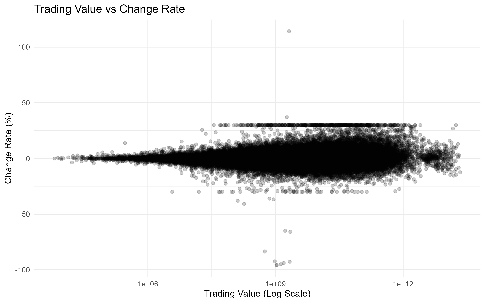
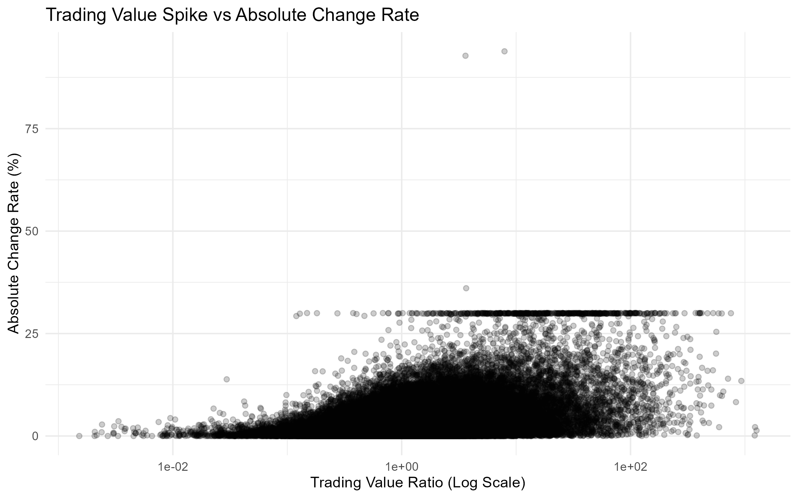
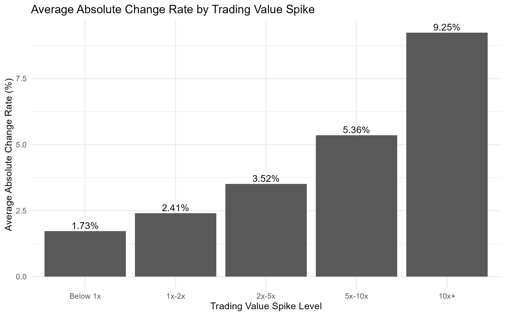
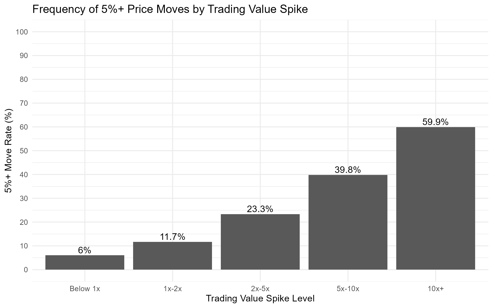
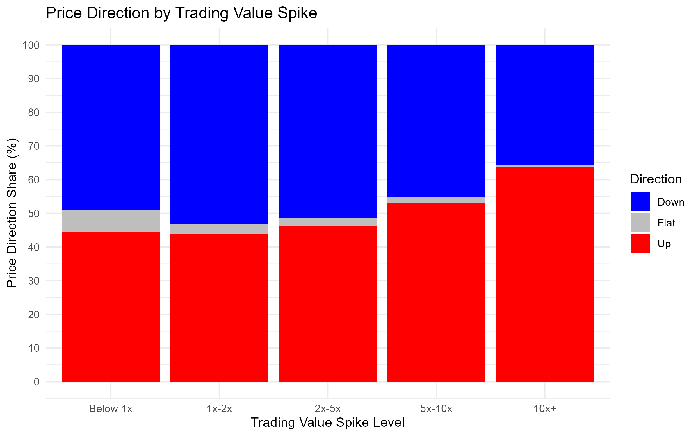
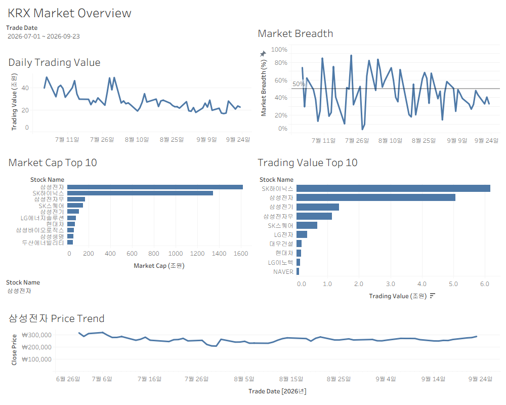

# KRX KOSPI 데이터 파이프라인과 시장 분석

KRX API에서 KOSPI 종목별 일별 시장 데이터를 수집하고, Python으로 정제·검증한 뒤 PostgreSQL에 저장합니다. 저장한 데이터를 R로 분석하고 Tableau로 시각화해, 수집부터 운영 자동화와 데이터 활용까지 연결한 프로젝트입니다.

Python은 날짜별 재실행·과거 데이터 수집·일일 자동 복구를 담당합니다. R에서는 거래대금 급증과 가격 변동의 관계를 살펴보고, Tableau에서는 시장 현황과 개별 종목의 흐름을 확인합니다.

## 처리 흐름

```text
KRX API → Raw JSON → pandas 정제 → CSV → 데이터 검증 → PostgreSQL
                                                       ├─ R 탐색 분석 → PNG 그래프
                                                       └─ Tableau 시장 대시보드
```

- **Extract:** 조회 날짜의 API 응답을 JSON으로 보관합니다. HTTP 오류나 응답 형식 오류는 실패로 처리합니다.
- **Transform:** 필요한 15개 컬럼을 선택하고 날짜·숫자 타입을 변환합니다.
- **Validation:** 날짜·종목코드 결측, 중복, 거래량·시가총액 음수, OHLC 범위를 검사합니다. OHLC 검사는 거래량이 양수인 행에만 적용하며, 거래량 0은 참고 항목입니다.
- **Load:** `psycopg`와 SQL로 적재합니다. 종목코드는 문자열로 유지합니다.

검증에 실패하면 적재하지 않습니다. `kospi_daily_prices`의 복합 Primary Key는 `(trade_date, ticker)`입니다. `ON CONFLICT ... DO UPDATE`로 기존 행을 갱신하므로 같은 날짜를 다시 실행해도 중복 행이 생기지 않습니다. 한 CSV의 적재는 하나의 transaction이며, 성공 시 commit하고 오류 시 전체 rollback합니다.

## 실행 제어

- `run_pipeline.py`: 한 날짜의 네 단계를 순서대로 실행합니다. 날짜를 생략하면 PC의 오늘 날짜를 사용합니다.
- `run_backfill.py`: 시작일부터 종료일까지 하루씩 기존 pipeline을 호출합니다. 실제 오류가 발생하면 해당 날짜에서 중단합니다.
- KRX가 정상 응답으로 빈 목록을 반환하면 비거래일 또는 데이터 미제공으로 보고 **SKIP**합니다. 종료 코드는 성공 `0`, 실패 `1`, 정상 SKIP `10`입니다. Backfill은 SKIP을 포함한 범위를 정상 완료하면 `0`을 반환합니다.
- `run_daily_pipeline.py`: DB 마지막 적재일 다음 날부터 오늘까지 backfill합니다. 마지막 적재일 이전의 중간 누락은 자동 탐지하지 않습니다. 빈 DB에서는 최초 backfill을 먼저 해야 합니다.
- 일일 실행에서 성공한 날짜가 있으면 처리 날짜·행 수·DB 마지막 적재일을 이메일로 요약합니다. 실패 시 단계와 오류 내용을 알리고, 전부 SKIP이면 메일을 보내지 않습니다. SMTP 장애는 적재 결과를 바꾸지 않습니다.

## 검증한 backfill 결과

2026-01-01~2026-09-15 범위의 당시 DB 조회 결과입니다.

| 항목 | 결과 |
|---|---:|
| 적재 거래일 | 173일 |
| 적재 행 수 | 163,997행 |
| 날짜+종목코드 중복 | 0건 |

DB에 없는 날짜는 기존 KRX 조회의 SKIP 기록과 대조했습니다. 별도 공식 거래일 달력과 대조한 결과는 아닙니다. 운영 데이터와 로그는 저장소에 포함하지 않습니다.

## R 분석: 거래대금 급증과 가격 변동

분석 코드: [r/krx_analysis.R](r/krx_analysis.R)

PostgreSQL의 `kospi_daily_prices` 전체 데이터를 읽어 종목별 일별 관측치를 분석합니다. `change_rate`는 상승·하락 부호가 있는 등락률, `abs(change_rate)`는 방향을 제거한 변동 크기입니다. 아래 분석 결과는 R 실행 시점에 PostgreSQL에 적재되어 있던 전체 데이터를 기준으로 하며, 앞서 제시한 backfill 검증 기간과는 표본 범위가 다를 수 있습니다. DB 데이터가 추가된 후 다시 실행하면 결과도 달라질 수 있습니다.

### 분석 기준

종목별 거래 규모 차이를 고려해 다음 비율을 계산합니다.

```text
Trading value spike ratio = 당일 거래대금 / 해당 종목의 전체 조회 기간 거래대금 중앙값
```

코드에서는 `ticker`, `stock_name`으로 그룹을 묶습니다. 중앙값이 0인 그룹은 제외하며, 이동 중앙값이나 과거 데이터만으로 계산한 기준은 아닙니다. 비율은 1배 미만, 1~2배 미만, 2~5배 미만, 5~10배 미만, 10배 이상으로 구분합니다.

구간별 비교에서는 절대 등락률이 30%를 초과하는 관측치를 제외합니다. 앞의 산점도 두 개는 이 제외 조건을 적용하기 전 자료이며, 로그 축을 사용하는 거래대금 또는 비율은 양수인 값만 표시합니다.

### 1. 거래대금과 부호가 있는 등락률

전체 종목·날짜 관측치를 함께 보면 거래대금과 부호가 있는 등락률의 선형 관계는 매우 약하게 관찰됐습니다. 거래대금이 크다는 사실만으로 상승 또는 하락 방향을 설명하기는 어렵습니다. 코드에서는 원 거래대금과 로그 거래대금의 상관계수를 각각 계산합니다.



### 2. 거래대금 급증 비율과 절대 등락률

종목별 중앙값으로 나눈 거래대금 급증 비율을 절대 등락률과 비교했습니다. 가격 방향보다 변동 크기에 초점을 둔 분석입니다.



### 3. 급증 구간별 변동 크기와 큰 변동 발생 비율

현재 분석에서는 거래대금 급증 구간이 높아질수록 평균 절대 등락률과 절대 등락률 5% 이상 관측치의 비율이 함께 증가했습니다.

| 거래대금 급증 구간 | 평균 절대 등락률 | 5% 이상 변동 발생 비율 |
|---|---:|---:|
| Below 1x | 1.73% | 6.0% |
| 1x–2x | 2.41% | 11.7% |
| 2x–5x | 3.52% | 23.3% |
| 5x–10x | 5.36% | 39.8% |
| 10x+ | 9.25% | 59.9% |





### 4. 급증 구간별 상승·하락·보합 비율

`10x+` 구간에서는 다른 구간보다 상승일 비중이 높게 관찰됐고, 같은 구간 안에서도 상승 비중이 하락 비중보다 컸습니다. 여기서 비중은 종목·날짜 관측치 기준이며, 다음 거래일의 상승 확률을 뜻하지 않습니다.



이 결과는 현재 표본의 탐색적 비교입니다. 거래대금 급증이 가격 변동을 일으킨다는 인과관계나 투자 예측 성능을 검증한 것은 아닙니다. 전체 조회 기간의 중앙값을 사용하므로 매매 신호의 과거 성과 검증으로도 해석하지 않습니다.

## Tableau 시각화

워크북: [tableau/krx_market_dashboard.twb](tableau/krx_market_dashboard.twb)

`KRX Market Overview` 대시보드는 PostgreSQL의 `kospi_daily_prices`를 연결해 다음 5개 시트로 시장 현황을 보여줍니다.



| 시트 | 내용 |
|---|---|
| Daily Trading Value | 일별 총 거래대금 추이. 조 원 단위로 표시 |
| Market Breadth | 일별 상승 종목 비율. 등락률이 양수이면 1, 아니면 0인 지표의 평균 |
| Market Cap Top 10 | 선택 날짜의 시가총액 상위 10개 종목 비교. 조 원 단위로 표시 |
| Selected Stock Price Trend | 선택한 종목의 가격 추이 |
| Trading Value Top 10 | 선택 날짜의 거래대금 상위 10개 종목 비교. 조 원 단위로 표시 |

`.twb`에는 화면과 연결 정의가 저장되어 있으며 DB 데이터 자체가 패키징되어 있지는 않습니다. Tableau에서 열고 본인의 PostgreSQL 접속 정보를 설정해야 합니다. 날짜와 종목 필터를 바꿔 조회할 수 있으며, 워크북을 여는 것만으로 Python 수집 작업이 실행되지는 않습니다.

## 프로젝트 구조

```text
src/
  extract/extract_krx.py
  transform/transform_krx.py
  validation/validate_krx.py
  load/load_krx.py
  notification/email_notifier.py
  run_pipeline.py
  run_backfill.py
  run_daily_pipeline.py
r/
  krx_analysis.R
images/
  trading_value_vs_change_rate.png
  trading_value_spike_vs_abs_change.png
  avg_abs_change_by_spike.png
  five_percent_move_frequency.png
  price_direction_by_spike.png
  tableau_market_overview.png
tableau/
  krx_market_dashboard.twb
run_daily_pipeline.bat
requirements.txt
.env.example
data/raw/          # 실행 시 생성, Git 제외
data/processed/    # 실행 시 생성, Git 제외
logs/             # 실행 시 생성, Git 제외
```

## 설치 및 설정

개발 환경은 Windows와 Python 3.12입니다. PostgreSQL 서버와 KRX API 인증키가 필요합니다. 아래 명령은 프로젝트 루트의 PowerShell에서 실행합니다.

```powershell
py -3.12 -m venv .venv
.\.venv\Scripts\python.exe -m pip install -r requirements.txt
Copy-Item .env.example .env
```

PostgreSQL 관리자 계정에서 프로젝트용 계정과 DB를 생성합니다. 다음 비밀번호는 예시이므로 실제 사용할 값으로 변경합니다.

```sql
CREATE USER krx_user WITH PASSWORD 'REPLACE_WITH_YOUR_PASSWORD';
CREATE DATABASE krx_market_data OWNER krx_user;
```

`.env.example`에는 다음 항목이 있습니다. 복사한 `.env`에 실제 값을 입력하고 Git에 올리지 않습니다.

```dotenv
KRX_API_KEY=
PGHOST=localhost
PGPORT=5432
PGDATABASE=krx_market_data
PGUSER=krx_user
PGPASSWORD=
EMAIL_FROM=
EMAIL_TO=
EMAIL_APP_PASSWORD=
SMTP_HOST=smtp.gmail.com
SMTP_PORT=587
```

이메일은 선택 설정입니다. Gmail의 2단계 인증을 켜고 발급한 앱 비밀번호를 사용합니다. SMTP 연결은 STARTTLS로 암호화하며, 설정이 비어 있으면 메일 발송만 생략합니다. 조직 계정은 앱 비밀번호 사용이 제한될 수 있습니다.

## 실행

```powershell
# 최초 적재 또는 특정 날짜 재실행
.\.venv\Scripts\python.exe src\run_pipeline.py 20260904

# 과거 범위 수집: 시작일과 종료일 포함
.\.venv\Scripts\python.exe src\run_backfill.py 20260101 20260915

# 오늘 날짜만 실행
.\.venv\Scripts\python.exe src\run_pipeline.py

# DB 마지막 적재일 이후 자동 보충 및 이메일 알림
.\run_daily_pipeline.bat
```

배치 파일은 프로젝트 루트로 이동한 뒤 `.venv`의 Python으로 일일 실행기를 호출합니다. SKIP 코드 `10`은 Windows에 정상 종료 `0`으로 전달합니다. 개별 단계 파일을 직접 실행하면 환경변수가 없는 경우 기존 기준일 `20260904`를 사용하므로, 날짜 지정은 실행기를 통해 하는 것을 권장합니다.

### R 분석 실행

R과 아래 패키지가 별도로 필요합니다. R 콘솔에서 한 번 설치합니다.

```r
install.packages(c("DBI", "RPostgres", "dplyr", "ggplot2", "dotenv"))
```

R도 Python과 같은 `PGHOST`, `PGPORT`, `PGDATABASE`, `PGUSER`, `PGPASSWORD`를 사용합니다. **작업 디렉터리는 `r/`이어야 합니다.** 코드가 `../.env`에서 설정을 읽고 `../images`에 그래프를 저장하기 때문입니다.

프로젝트 루트의 PowerShell에서 다음과 같이 실행합니다. `Rscript`가 PATH에 등록되어 있어야 합니다.

```powershell
Set-Location r
Rscript krx_analysis.R
Set-Location ..
```

실행하면 DB를 읽어 분석하고 PNG 5개를 갱신합니다. 이미지 배경은 흰색으로 저장됩니다. R 분석과 Tableau는 일일 Python 예약 작업에 포함되지 않으며 별도로 실행합니다.

## Windows Task Scheduler

개발 PC에는 `KRX Daily Pipeline`을 매일 지정 시간에 실행하도록 등록하고 수동 실행을 확인했습니다. 다른 PC에서는 별도 등록이 필요합니다.

| 항목 | 설정 |
|---|---|
| 프로그램 | `C:\Windows\System32\cmd.exe` |
| 인수 | `/d /c ""<프로젝트 절대 경로>\run_daily_pipeline.bat""` |
| 시작 위치 | 프로젝트 절대 경로 |
| 주기 | 매일 지정 시간, PC 시간대 기준 |
| 절전 | 작업 실행을 위해 절전 모드 해제 |
| 실패 재시도 | 10분 간격, 최대 3회 |
| 중복 실행 | 새 인스턴스를 시작하지 않음 |

절전 해제는 PC의 전원 설정이 지원해야 하며, 전원이 꺼진 PC를 켜는 기능은 아닙니다. 로그아웃 상태에서도 실행하려면 작업 속성에서 해당 옵션을 선택하고 Windows 계정 인증을 직접 설정해야 합니다. 네트워크 연결과 PostgreSQL 서비스도 필요합니다.

## 로그와 운영 범위

- `logs/run_pipeline.log`: 조회 날짜와 단계별 START / SUCCESS / FAILED, 데이터 없음 SKIP
- `logs/run_backfill.log`: 날짜별 요약, 일일 복구 실행 결과, 이메일 발송 결과

마지막 적재일 이후 데이터가 늦게 제공되거나 PC가 꺼져 있었다면 다음 일일 실행에서 다시 조회합니다. 더 최근 날짜가 먼저 적재되어 그 이전에 빈 날짜가 남은 경우에는 해당 구간을 수동 backfill해야 합니다. 데이터 변환 과정의 모든 결측값을 검증하는 구조는 아니며, 현재 검증은 위에 명시한 항목을 대상으로 합니다.

## 데이터 출처

- KRX Data Marketplace OPEN API
- 한국거래소 통계정보

API 인증키와 개인 환경변수는 저장소에 포함하지 않습니다.
